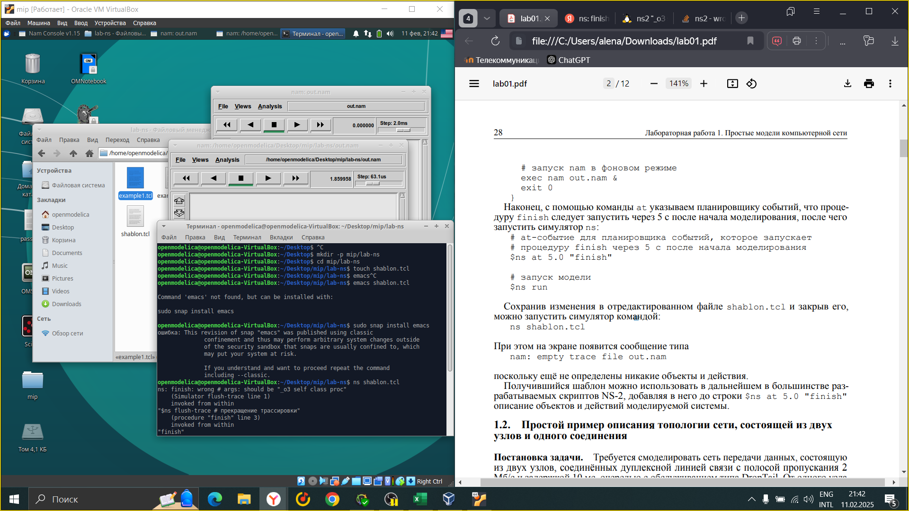
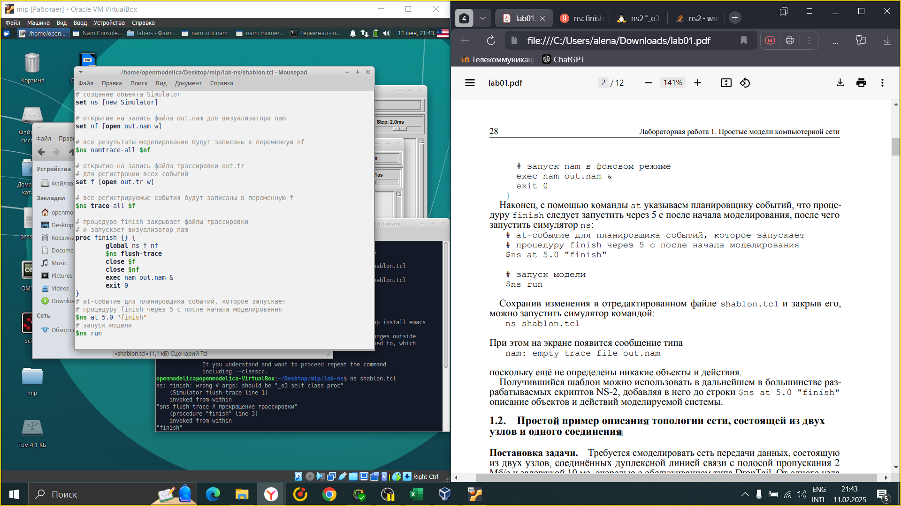
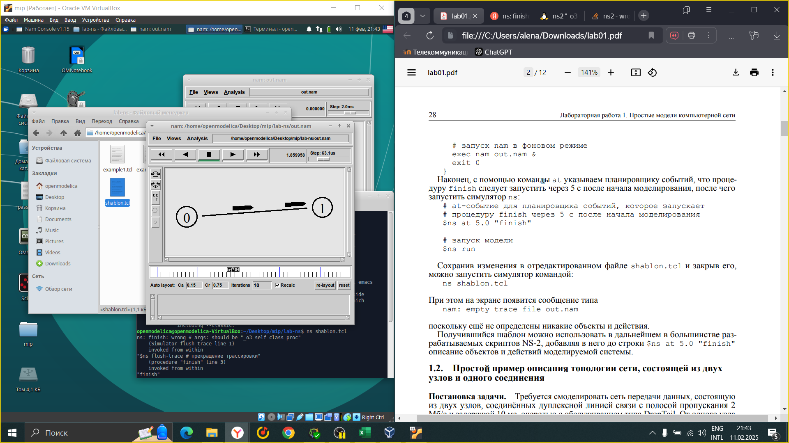
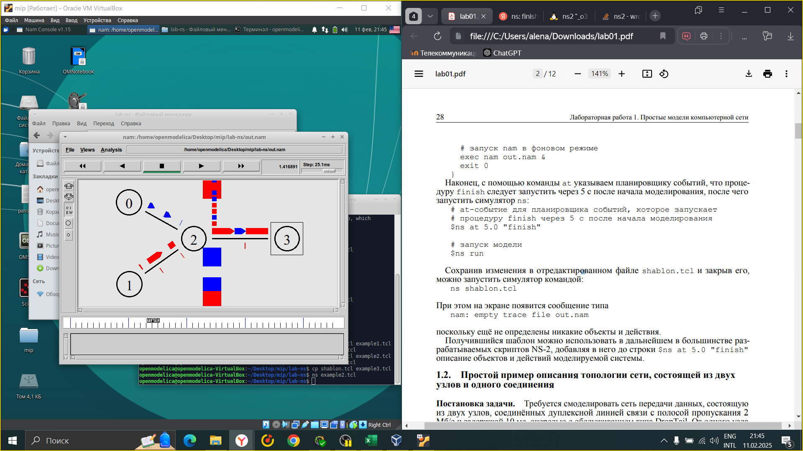
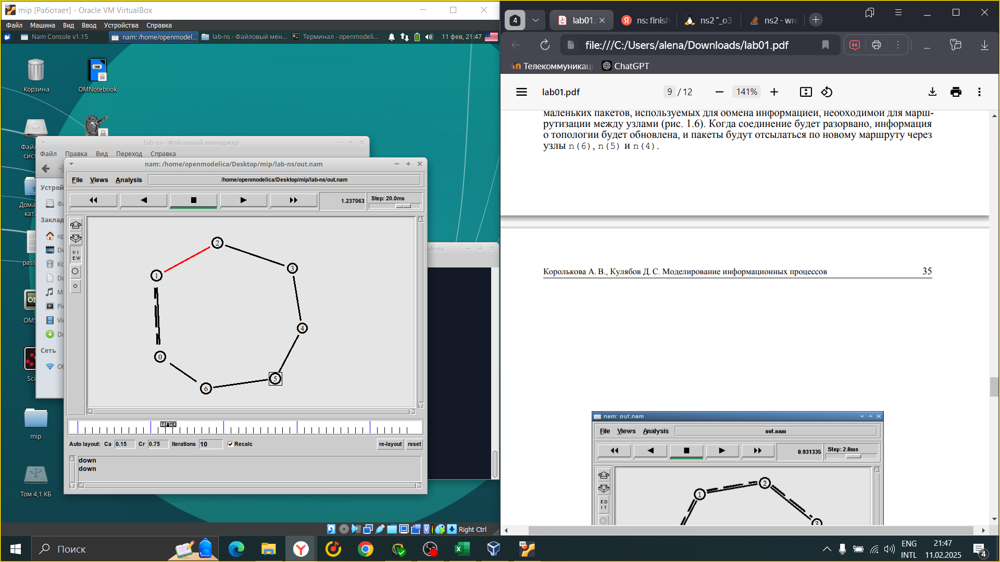
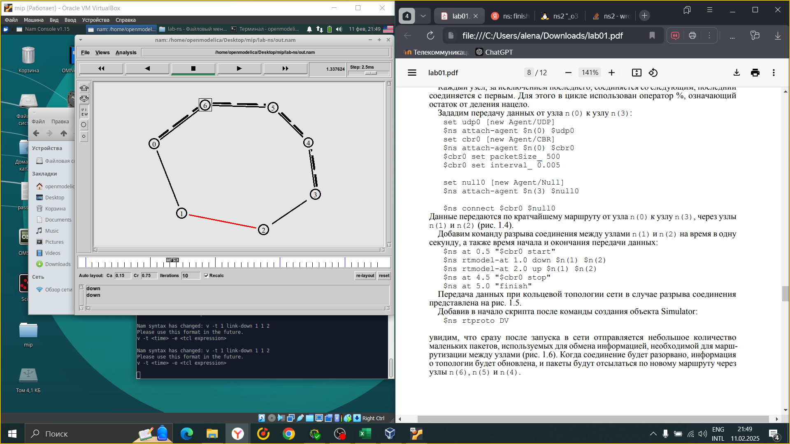
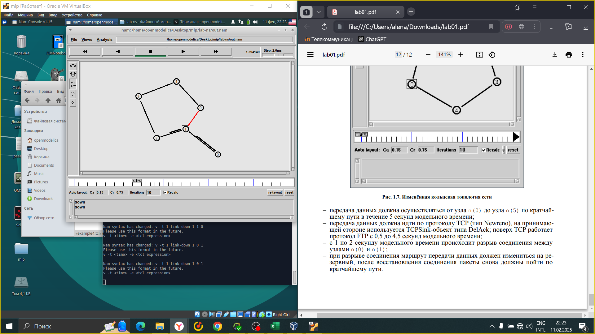
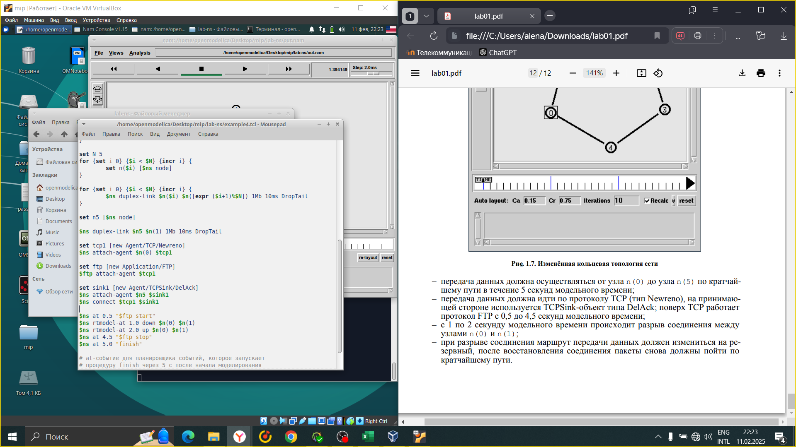

---
## Front matter
lang: ru-RU
title: Лабораторная работа 1
subtitle: Простые модели компьютерной сети
author:
  - Горяйнова А.А.
institute:
  - Российский университет дружбы народов, Москва, Россия
date: 15 февраля 2004

## i18n babel
babel-lang: russian
babel-otherlangs: english

## Formatting pdf
toc: false
toc-title: Содержание
slide_level: 2
aspectratio: 169
section-titles: true
theme: metropolis
header-includes:
 - \metroset{progressbar=frametitle,sectionpage=progressbar,numbering=fraction}
---

# Информация

## Докладчик

:::::::::::::: {.columns align=center}
::: {.column width="70%"}

  * Горяйнова Алёна Андреевна
  * студент
  * Российский университет дружбы народов

:::
::: {.column width="30%"}

:::
::::::::::::::

## Цель работы

Приобрести навыки моделирования сетей передачи данных с помощью средства имитационного моделирования NS-2, а также проанализировать полученные результаты моделирования.

## Задание

1. Создать шаблон сценария для NS-2;
2. Выполнить простой пример описания топологии сети, состоящей из двух узлов и одного соединения;
3. Выполнить пример с усложнённой топологией сети;
4. Выполнить пример с кольцевой топологией сети;
5. Выполнить упражнение.

# Выполнение лабораторной работы

## Создание дирекотрии и файла shablon.tcl

{#fig:1 width=70%}

## Код шаблона

{#fig:2 width=70%

## Простой пример описания топологии сети, состоящей из двух узлов и одного соединения 

{#fig:3 width=70%}

## Пример с усложнённой топологией сети

{#fig:4 width=70%}

## Пример с кольцевой топологией сети, где при разрыве соединения маршрут передачи данных не изменится

{#fig:5 width=70%}

## Пример с кольцевой топологией сети, где при разрыве соединения маршрут передачи данных изменится на резервный

{#fig:6 width=70%}

## Упражнение

{#fig:7 width=70%}

## Внесенные изменения в коде

{#fig:8 width=70%}

:::

