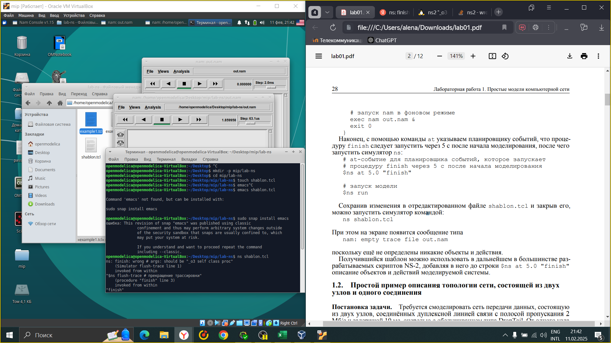
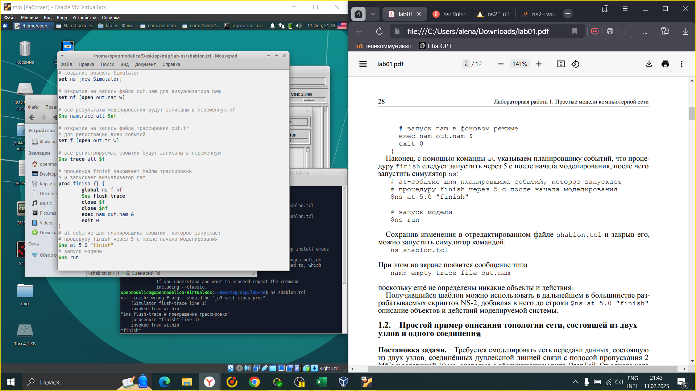
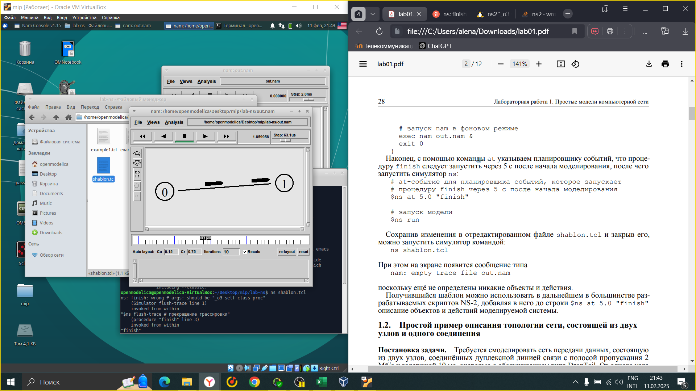
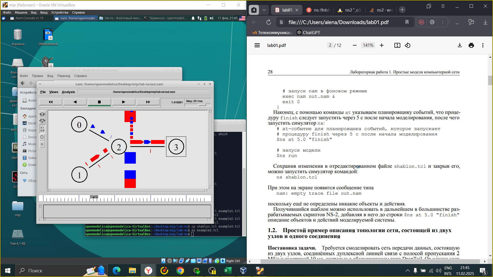
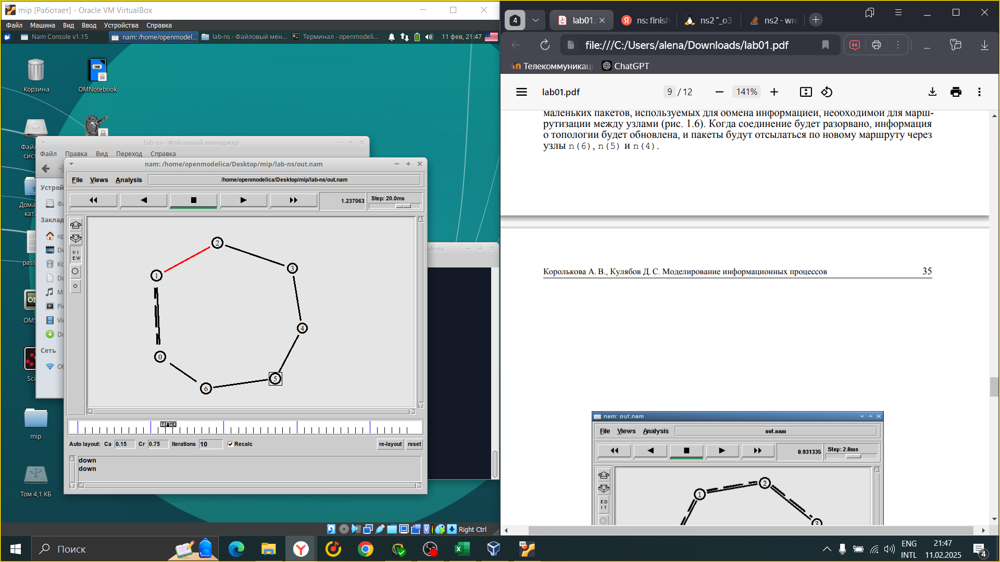
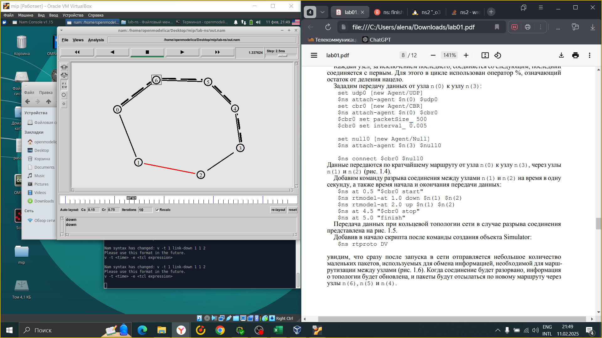
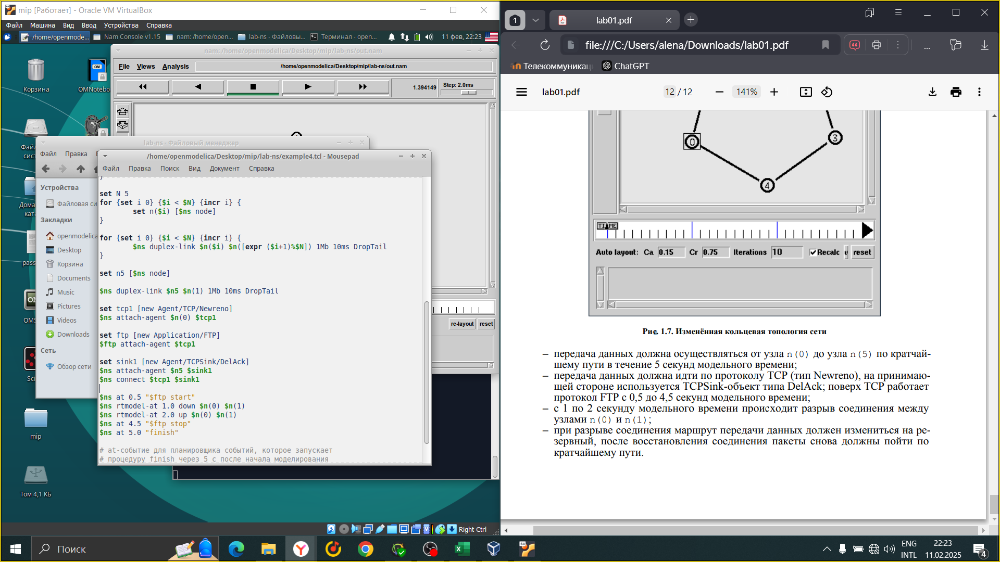

---
## Front matter
title: "Лабораторная работа 1"
subtitle: "Простые модели компьютерной сети"
author: "Горяйнова Алёна Андреевна"

## Generic otions
lang: ru-RU
toc-title: "Содержание"

## Bibliography
bibliography: bib/cite.bib
csl: pandoc/csl/gost-r-7-0-5-2008-numeric.csl

## Pdf output format
toc: true # Table of contents
toc-depth: 2
lof: true # List of figures
lot: true # List of tables
fontsize: 12pt
linestretch: 1.5
papersize: a4
documentclass: scrreprt
## I18n polyglossia
polyglossia-lang:
  name: russian
  options:
	- spelling=modern
	- babelshorthands=true
polyglossia-otherlangs:
  name: english
## I18n babel
babel-lang: russian
babel-otherlangs: english
## Fonts
mainfont: IBM Plex Serif
romanfont: IBM Plex Serif
sansfont: IBM Plex Sans
monofont: IBM Plex Mono
mathfont: STIX Two Math
mainfontoptions: Ligatures=Common,Ligatures=TeX,Scale=0.94
romanfontoptions: Ligatures=Common,Ligatures=TeX,Scale=0.94
sansfontoptions: Ligatures=Common,Ligatures=TeX,Scale=MatchLowercase,Scale=0.94
monofontoptions: Scale=MatchLowercase,Scale=0.94,FakeStretch=0.9
mathfontoptions:
## Biblatex
biblatex: true
biblio-style: "gost-numeric"
biblatexoptions:
  - parentracker=true
  - backend=biber
  - hyperref=auto
  - language=auto
  - autolang=other*
  - citestyle=gost-numeric
## Pandoc-crossref LaTeX customization
figureTitle: "Рис."
tableTitle: "Таблица"
listingTitle: "Листинг"
lofTitle: "Список иллюстраций"
lotTitle: "Список таблиц"
lolTitle: "Листинги"
## Misc options
indent: true
header-includes:
  - \usepackage{indentfirst}
  - \usepackage{float} # keep figures where there are in the text
  - \floatplacement{figure}{H} # keep figures where there are in the text
---

# Цель работы

Приобретение навыков моделирования сетей передачи данных с помощью сред-
ства имитационного моделирования NS-2, а также анализ полученных результатов
моделирования

# Задание

1. Создать шаблон сценария для NS-2;
2. Выполнить простой пример описания топологии сети, состоящей из двух узлов и одного соединения;
3. Выполнить пример с усложнённой топологией сети;
4. Выполнить пример с кольцевой топологией сети;
5. Выполнить упражнение.

# Теоретическое введение

Network Simulator (NS-2) — один из программных симуляторов моделирования
процессов в компьютерных сетях. NS-2 позволяет описать топологию сети, кон-
фигурацию источников и приёмников трафика, параметры соединений (полосу
пропускания, задержку, вероятность потерь пакетов и т.д.) и множество других
параметров моделируемой системы. Данные о динамике трафика, состоянии со-
единений и объектов сети, а также информация о работе протоколов фиксируются
в генерируемом trace-файле
# Выполнение лабораторной работы

Создали директорию и файл shablon.tcl(рис. [-@fig:1]).

{#fig:1 width=70%}

Создали шаблон, который будем использовать в дальнейшем (рис. [-@fig:2]).

{#fig:2 width=70%}

Простой пример описания топологии сети, состоящей из двух
узлов и одного соединения (рис. [-@fig:3]).

{#fig:3 width=70%}

Пример с усложнённой топологией сети (рис. [-@fig:4]).

{#fig:4 width=70%}

Пример с кольцевой топологией сети, где при разрыве соединения маршрут передачи данных не изменится (рис. [-@fig:5]).

{#fig:5 width=70%}

Пример с кольцевой топологией сети, где при разрыве соединения маршрут передачи данных изменится на резервный(рис. [-@fig:6]).

{#fig:6 width=70%}

Изменим количество узлов в кольце на 5, а 6 узел n(5) отдельно присоединим к
узлу n(1). 
Вместо агента UDP создадим агента TCP (типа Newreno), а на принимающей
стороне используем TCPSink-объект типа DelAck; поверх TCP работает протокол
FTP с 0,5 до 4,5 секунд модельного времени Также зададим с 1 по 2 секунду
модельного времени разрыв соединения между узлами n(0) и n(1)(рис. [-@fig:7]), ([-@fig:8]).

{#fig:7 width=70%}

{#fig:8 width=70%}

# Выводы

В процессе выполнения данной лабораторной работы я приобрела навыки моделирования сетей передачи данных с помощью средства имитационного моделирования NS-2, а также проанализировала полученные результаты моделирования.

# Список литературы{.unnumbered}

::: {#refs}
:::
