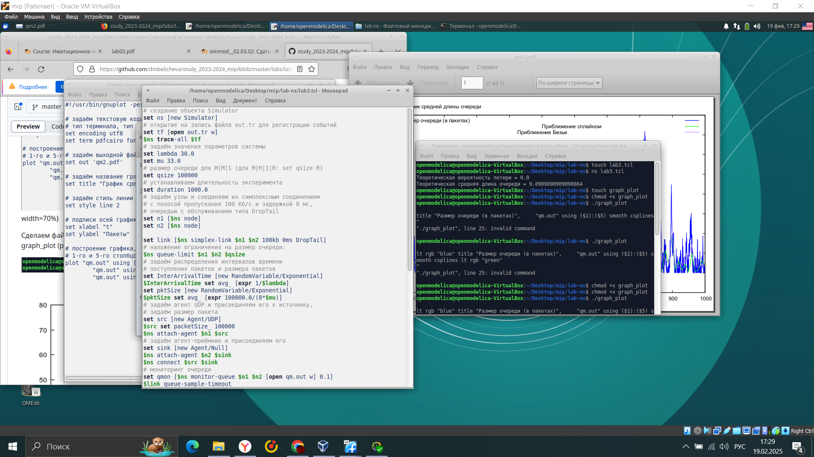
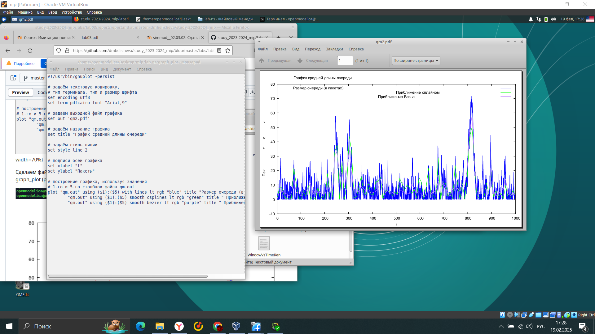

---
## Front matter
lang: ru-RU
title: Лабораторная работа 3
subtitle: Моделирование стохастических процессов
author:
  - Горяйнова
institute:
  - Российский университет дружбы народов, Москва, Россия

## i18n babel
babel-lang: russian
babel-otherlangs: english

## Formatting pdf
toc: false
toc-title: Содержание
slide_level: 2
aspectratio: 169
section-titles: true
theme: metropolis
header-includes:
 - \metroset{progressbar=frametitle,sectionpage=progressbar,numbering=fraction}
---

# Информация

## Докладчик

:::::::::::::: {.columns align=center}
::: {.column width="70%"}

  * Горяйнова Алёна Андреевна
  * студентка
  * Российский университет дружбы народов

:::
::: {.column width="30%"}

:::
::::::::::::::

## Цель работы

Провести моделирование системы массового обслуживания (СМО).

## Задание

1. Реализовать модель $M|M|1$;
2. Посчитать загрузку системы и вероятность потери пакетов;
3. Построить график изменения размера очереди.

# Выполнение лабораторной работы

## Запустив программу, получим значения  загрузки системы и вероятности потери пакетов

{#fig:001 width=70%}

## Создали файл graph_plot, сделали его исполняемым и скомпилировали

{#fig:002 width=70%}

## Выводы

В процессе выполнения данной лабораторной работы я провела моделирование системы массового обслуживания (СМО).

:::

