---
## Front matter
title: "Лабораторная работа 11"
subtitle: "Модель системы массового обслуживания M |M |1"
author: "Горяйнова АА"

## Generic otions
lang: ru-RU
toc-title: "Содержание"

## Bibliography
bibliography: bib/cite.bib
csl: pandoc/csl/gost-r-7-0-5-2008-numeric.csl

## Pdf output format
toc: true # Table of contents
toc-depth: 2
lof: true # List of figures
lot: true # List of tables
fontsize: 12pt
linestretch: 1.5
papersize: a4
documentclass: scrreprt
## I18n polyglossia
polyglossia-lang:
  name: russian
  options:
	- spelling=modern
	- babelshorthands=true
polyglossia-otherlangs:
  name: english
## I18n babel
babel-lang: russian
babel-otherlangs: english
## Fonts
mainfont: IBM Plex Serif
romanfont: IBM Plex Serif
sansfont: IBM Plex Sans
monofont: IBM Plex Mono
mathfont: STIX Two Math
mainfontoptions: Ligatures=Common,Ligatures=TeX,Scale=0.94
romanfontoptions: Ligatures=Common,Ligatures=TeX,Scale=0.94
sansfontoptions: Ligatures=Common,Ligatures=TeX,Scale=MatchLowercase,Scale=0.94
monofontoptions: Scale=MatchLowercase,Scale=0.94,FakeStretch=0.9
mathfontoptions:
## Biblatex
biblatex: true
biblio-style: "gost-numeric"
biblatexoptions:
  - parentracker=true
  - backend=biber
  - hyperref=auto
  - language=auto
  - autolang=other*
  - citestyle=gost-numeric
## Pandoc-crossref LaTeX customization
figureTitle: "Рис."
tableTitle: "Таблица"
listingTitle: "Листинг"
lofTitle: "Список иллюстраций"
lotTitle: "Список таблиц"
lolTitle: "Листинги"
## Misc options
indent: true
header-includes:
  - \usepackage{indentfirst}
  - \usepackage{float} # keep figures where there are in the text
  - \floatplacement{figure}{H} # keep figures where there are in the text
---

# Цель работы

Реализовать модель $M|M|1$ в CPN tools.

# Задание

- Реализовать в CPN Tools модель системы массового обслуживания M|M|1.
- Настроить мониторинг параметров моделируемой системы и нарисовать графики очереди.

# Выполнение лабораторной работы

**Постановка задачи**

В систему поступает поток заявок двух типов, распределённый по пуассоновскому
закону. Заявки поступают в очередь сервера на обработку. Дисциплина очереди -
FIFO. Если сервер находится в режиме ожидания (нет заявок на сервере), то заявка
поступает на обработку сервером.

Будем использовать три отдельных листа: на первом листе опишем граф системы
(рис. [-@fig:001]), на втором — генератор заявок (рис. [-@fig:002]), на третьем — сервер обработки
заявок (рис. [-@fig:003]).
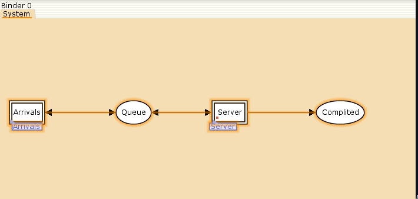{#fig:001 width=70%}

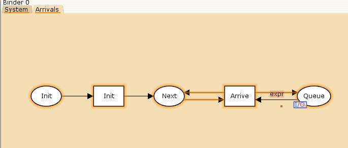{#fig:002 width=70%}

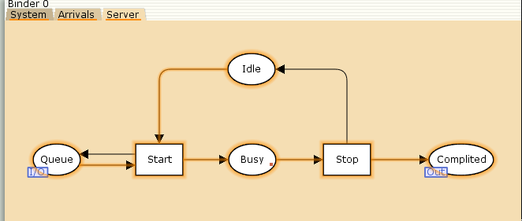{#fig:003 width=70%}

Зададим декларации системы (рис. [-@fig:004]).

Определим множества цветов системы (colorset):

- фишки типа `UNIT` определяют моменты времени;
- фишки типа `INT` определяют моменты поступления заявок в систему.
- фишки типа `JobType` определяют 2 типа заявок — A и B;
- кортеж `Job` имеет 2 поля: jobType определяет тип работы (соответственно имеет тип `JobType`, поле `AT` имеет тип `INT` и используется для хранения времени нахождения заявки в системе);
- фишки `Jobs` — список заявок;
- фишки типа `ServerxJob` — определяют состояние сервера, занятого обработкой
заявок.

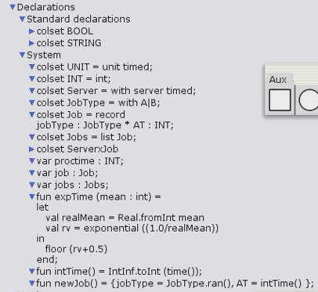{#fig:004 width=70%}

Зададим параметры модели на графах сети.
На листе System (рис. [-@fig:005]):
– у позиции Queue множество цветов фишек — Jobs; начальная маркировка 1`[]
определяет, что изначально очередь пуста.
– у позиции Completed множество цветов фишек — Job. 

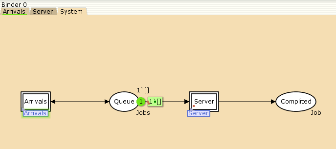{#fig:005 width=70%}

На листе Arrivals (рис. [-@fig:006]):
– у позиции Init: множество цветов фишек — UNIT; начальная маркировка 1`()@0
определяет, что поступление заявок в систему начинается с нулевого момента
времени;
– у позиции Next: множество цветов фишек — UNIT;

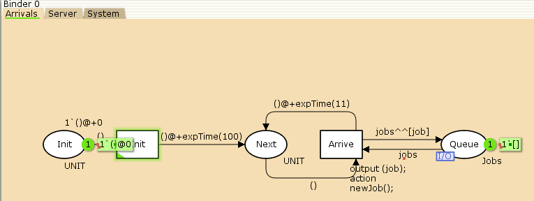{#fig:006 width=70%}

На листе Server (рис. [-@fig:007]):
– у позиции Busy: множество цветов фишек — Server, начальное значение мар-
кировки — 1`server@0 определяет, что изначально на сервере нет заявок на
обслуживание;
– у позиции Idle: множество цветов фишек — ServerxJob;
– переход Start имеет сегмент кода
output (proctime); action expTime(90); определяющий, что время об-
служивания заявки распределено по экспоненциальному закону со средним
временем обработки в 90 единиц времени;
– на дуге от позиции Queue к переходу Start выражение job::jobs определяет,
что сервер может начать обработку заявки, если в очереди есть хотя бы одна
заявка;
– на дуге от перехода Start к позиции Busy выражение
(server,job)@+proctime запускает функцию расчёта времени обработки заяв-
ки на сервере;
– на дуге от позиции Busy к переходу Stop выражение (server,job) говорит
о завершении обработки заявки на сервере;
– на дуге от перехода Stop к позиции Completed выражение job показывает, что
заявка считается обслуженной;
– выражение server на дугах от и к позиции Idle определяет изменение состояние
сервера (обрабатывает заявки или ожидает);
– на дуге от перехода Start к позиции Queue выражение jobs задаёт обратную
связь.

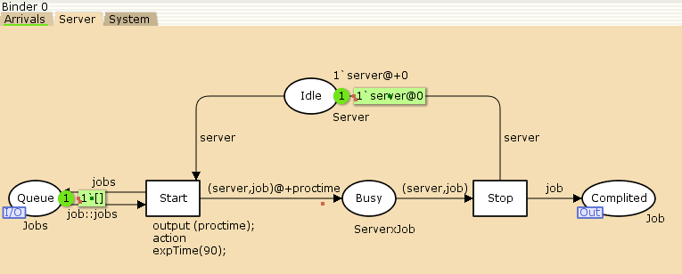{#fig:007 width=70%}

Выбираем Break Point (точка останова) и уста-
навливаем её на переход Start. После этого в разделе меню Monitor появится новый
подраздел, который назовём Ostanovka. В этом подразделе необходимо внести изме-
нения в функцию Predicate, которая будет выполняться при запуске монитора(рис. [-@fig:008])

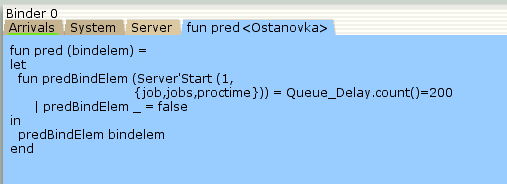{#fig:008 width=70%}

Функция Observer выполняется тогда, когда функция предикатора выдаёт значе-
ние true. По умолчанию функция выдаёт 0 или унарный минус (~1), подчёркивание
обозначает произвольный аргумент. Изменим её так, чтобы получить значение задержки в очереди. Для этого необходимо из текущего времени intTime() вычесть временную метку AT , означающую
приход заявки в очередь (рис. [-@fig:009])

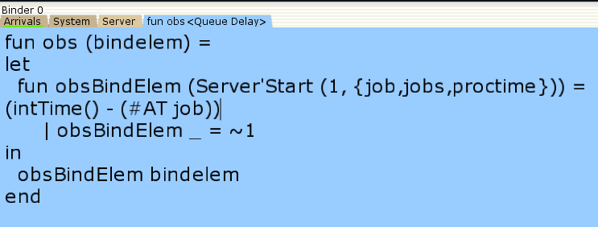{#fig:009 width=70%}

После запуска программы на выполнение в каталоге с кодом программы появит-
ся файл Queue_Delay.log, содержащий в первой колонке — значение задержки
очереди, во второй — счётчик, в третьей — шаг, в четвёртой — время. С помощью 114 Лабораторная работа 11. Модель системы массового обслуживания M |M |1
gnuplot можно построить график значений задержки в очереди (рис. [-@fig:010]), выбрав по оси x время, а по оси y — значения задержки.
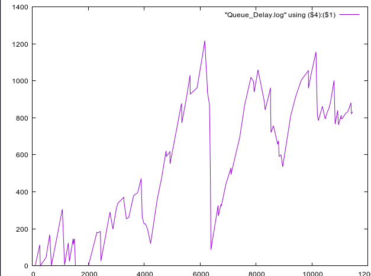{#fig:010 width=70%}

Посчитаем задержку в действительных значениях. С помощью палитры Monitoring
выбираем Data Call и устанавливаем на переходе Start. Появившийся в меню
монитор называем Queue Delay Real.
По сравнению с предыдущим описанием функции добавлено преобразование
значения функции из целого в действительное, при этом obsBindElem _ принимает
значение ~1.0.
После запуска программы на выполнение в каталоге с кодом программы появится
файл Queue_Delay_Real.log с содержимым, аналогичным содержимому файла
Queue_Delay.log, но значения задержки имеют действительный тип.
Посчитаем, сколько раз задержка превысила заданное значение. С помощью палит-
ры Monitoring выбираем Data Call и устанавливаем на переходе Start. Монитор
называем Long Delay Time
Если значение монитора Queue Delay превысит некоторое заданное значение,
то функция выдаст 1, в противном случае — 0. Восклицательный знак означает
разыменование ссылки.
При этом необходимо в декларациях  задать глобальную переменную
(в форме ссылки на число 200): longdelaytime:
globref longdelaytime = 200;
116 Лабораторная работа 11. Модель системы массового обслуживания M |M |1
Если значение монитора Queue Delay превысит некоторое заданное значение,
то функция выдаст 1, в противном случае — 0. Восклицательный знак означает
разыменование ссылки.
При этом необходимо в декларациях  задать глобальную переменную
(в форме ссылки на число 200): longdelaytime:
globref longdelaytime = 200;
С помощью gnuplot можно построить график (рис. [-@fig:011]), демонстрирующий,
в какие периоды времени значения задержки в очереди превышали заданное значение
200:
gnuplot
plot [0:][0:1.2] "Long_Delay_Time.log" using ($4):($1) with lines
quit
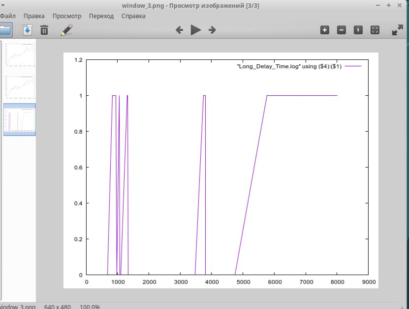{#fig:011 width=70%}

# Выводы

Я реализовала модель $M|M|1$ в CPN tools. 

# Список литературы{.unnumbered}

::: {#refs}
:::
