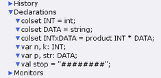
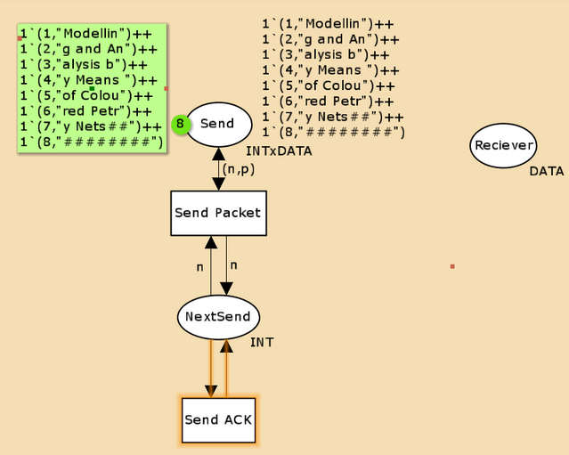
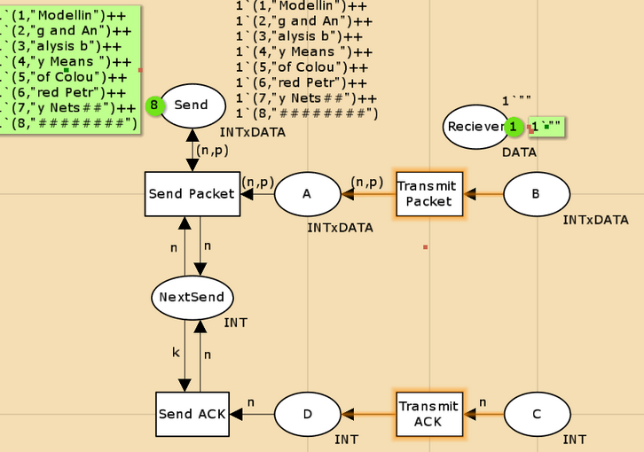
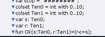
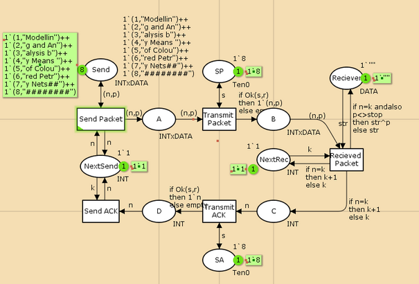
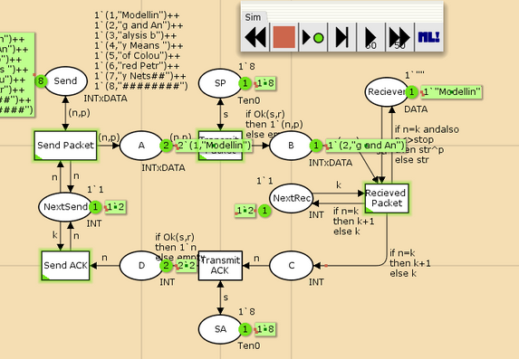
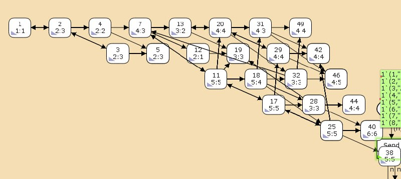

---
## Front matter
lang: ru-RU
title: Лабораторная работа №12
subtitle: Пример моделирования простого протокола передачи данных
author:
  - Горяйнова А.А.
institute:
  - Российский университет дружбы народов, Москва, Россия

## i18n babel
babel-lang: russian
babel-otherlangs: english

## Formatting pdf
toc: false
toc-title: Содержание
slide_level: 2
aspectratio: 169
section-titles: true
theme: metropolis
header-includes:
 - \metroset{progressbar=frametitle,sectionpage=progressbar,numbering=fraction}
 - '\makeatletter'
 - '\beamer@ignorenonframefalse'
 - '\makeatother'
---

# Информация

## Докладчик

:::::::::::::: {.columns align=center}
::: {.column width="60%"}

  * Горяйнова Алёна Андреевна
  * студентка
  * Российский университет дружбы народов

:::
::: {.column width="25%"}


:::
::::::::::::::

## Цели и задачи

**Цель работы**

Реализовать простой протокол передачи данных в CPN Tools.

**Задание**

- Реализовать простой протокол передачи данных в CPN Tools.
- Вычислить пространство состояний, сформировать отчет о нем и построить граф.

## Выполнение лабораторной работы

{#fig:001 width=70%}

## Выполнение лабораторной работы

{#fig:002 width=60%}

## Выполнение лабораторной работы

{#fig:003 width=60%}

## Выполнение лабораторной работы

{#fig:004 width=70%}

## Выполнение лабораторной работы

{#fig:005 width=70%}

## Выполнение лабораторной работы

{#fig:006 width=70%}

## Упражнение

```
CPN Tools state space report for:
/home/openmodelica/Desktop/lab12.cpn
Report generated: Fri Apr 25 18:40:33 2025

 Statistics
------------------------------------------------------------------------

  State Space
     Nodes:  16896
     Arcs:   306863
     Secs:   300
     Status: Partial

  Scc Graph
     Nodes:  10196
     Arcs:   276070
     Secs:   9


```

## Упражнение

```
Boundedness Properties
------------------------------------------------------------------------

  Best Integer Bounds
                             Upper      Lower
     New_Page'A 1            17         0
     New_Page'B 1            9          0
     New_Page'C 1            6          0
     New_Page'D 1            5          0
     New_Page'NextRec 1      1          1
     New_Page'NextSend 1     1          1
     New_Page'Reciever 1     1          1
     New_Page'SA 1           1          1
     New_Page'SP 1           1          1
     New_Page'Send 1         8          8
```

## Упражнение

{#fig:007 width=70%}

## Выводы

В процессе выполнения данной лабораторной работы я реализовала простой протокол передачи данных в CPN Tools и проведен анализ его пространства состояний.
