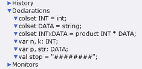
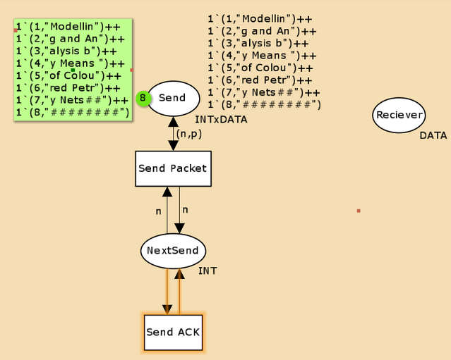
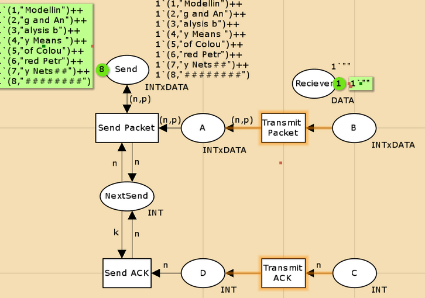
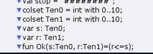
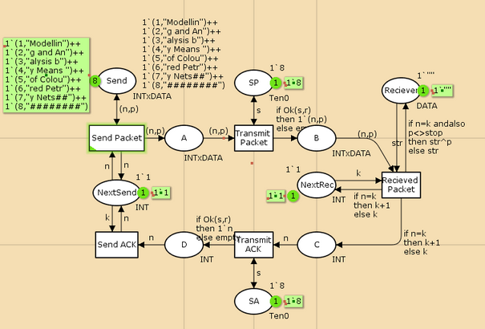
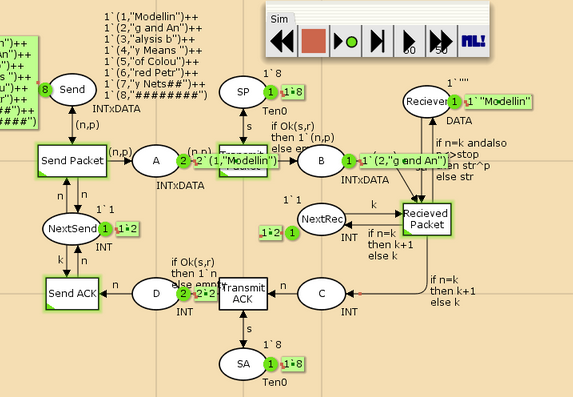
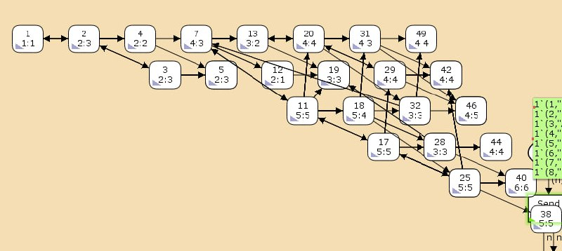

---
## Front matter
title: "Лабораторная работа  12"
subtitle: "Простейший вариант"
author: "Горяйнова Алёна Андреевна"

## Generic otions
lang: ru-RU
toc-title: "Содержание"

## Bibliography
bibliography: bib/cite.bib
csl: pandoc/csl/gost-r-7-0-5-2008-numeric.csl

## Pdf output format
toc: true # Table of contents
toc-depth: 2
lof: true # List of figures
lot: true # List of tables
fontsize: 12pt
linestretch: 1.5
papersize: a4
documentclass: scrreprt
## I18n polyglossia
polyglossia-lang:
  name: russian
  options:
	- spelling=modern
	- babelshorthands=true
polyglossia-otherlangs:
  name: english
## I18n babel
babel-lang: russian
babel-otherlangs: english
## Fonts
mainfont: IBM Plex Serif
romanfont: IBM Plex Serif
sansfont: IBM Plex Sans
monofont: IBM Plex Mono
mathfont: STIX Two Math
mainfontoptions: Ligatures=Common,Ligatures=TeX,Scale=0.94
romanfontoptions: Ligatures=Common,Ligatures=TeX,Scale=0.94
sansfontoptions: Ligatures=Common,Ligatures=TeX,Scale=MatchLowercase,Scale=0.94
monofontoptions: Scale=MatchLowercase,Scale=0.94,FakeStretch=0.9
mathfontoptions:
## Biblatex
biblatex: true
biblio-style: "gost-numeric"
biblatexoptions:
  - parentracker=true
  - backend=biber
  - hyperref=auto
  - language=auto
  - autolang=other*
  - citestyle=gost-numeric
## Pandoc-crossref LaTeX customization
figureTitle: "Рис."
tableTitle: "Таблица"
listingTitle: "Листинг"
lofTitle: "Список иллюстраций"
lotTitle: "Список таблиц"
lolTitle: "Листинги"
## Misc options
indent: true
header-includes:
  - \usepackage{indentfirst}
  - \usepackage{float} # keep figures where there are in the text
  - \floatplacement{figure}{H} # keep figures where there are in the text
---

# Цель работы

Реализовать простой протокол передачи данных в CPN Tools.

# Задание

- Реализовать простой протокол передачи данных в CPN Tools.
- Вычислить пространство состояний, сформировать отчет о нем и построить граф.

# Выполнение лабораторной работы

Основные состояния: источник (Send), получатель (Receiver).
Действия (переходы): отправить пакет (Send Packet), отправить подтверждение
(Send ACK).
Промежуточное состояние: следующий посылаемый пакет (NextSend).
Зададим декларации модели(рис. [-@fig:001]).

{#fig:001 width=70%}

Стоповый байт ("########") определяет, что сообщение закончилось.
Состояние Receiver имеет тип DATA и начальное значение 1`"" (т.е. пустая
строка, поскольку состояние собирает данные и номер пакета его не интересует).
Состояние NextSend имеет тип INT и начальное значение 1`1.
Поскольку пакеты представляют собой кортеж, состоящий из номера пакета и стро-
ки, то выражение у двусторонней дуги будет иметь значение (n,p).  
Кроме того, необходимо взаимодействовать с состоянием, которое будет сообщать
номер следующего посылаемого пакета данных. Поэтому переход Send Packet
соединяем с состоянием NextSend двумя дугами с выражениями n (рис. [-@fig:002]).

{#fig:002 width=70%}

Зададим промежуточные состояния (A, B с типом INTxDATA, C, D с типом
INTxDATA) для переходов (рис. [-@fig:003]): передать пакет Transmit Packet (передаём
(n,p)), передать подтверждение Transmit ACK (передаём целое число k).
Добавляем переход получения пакета (Receive Packet).

{#fig:003 width=70%}

На переходах Transmit Packet и Transmit ACK зададим потерю пакетов. Для
этого на интервале от 0 до 10 зададим пороговое значение и, если передаваемое значение превысит этот порог, то считаем, что произошла потеря пакета, если нет, то
передаём пакет дальше. Для этого задаём вспомогательные состояния SP и SA с типом
Ten0 и начальным значением 1`8, соединяем с соответствующими переходами. (рис. [-@fig:004])

{#fig:004 width=70%}

Таким образом, получим модель простого протокола передачи данных (рис. [-@fig:005], [-@fig:006])

{#fig:005 width=70%}

{#fig:006 width=70%}

Вычислим пространство состояний. Прежде, чем пространство состояний может быть вычислено и проанализировано, необходимо сформировать код пространства состояний. Этот код создается, когда используется инструмент Войти в пространство состояний. Вход в пространство состояний занимает некоторое время. Затем, если ожидается, что пространство состояний будет небольшим, можно просто применить инструмент Вычислить пространство состояний к листу, содержащему страницу сети. Сформируем отчёт о пространстве состояний и проанализируем его.  Чтобы сохранить отчет, необходимо применить инструмент Сохранить отчет о пространстве состояний к листу, содержащему страницу сети и ввести имя файла отчета.

Из него можно увидеть:

- 16896 состояний и 306863 переходов между ними.
- Указаны границы значений для каждого элемента: промежуточные состояния A, B, C, вспомогательные состояния SP, SA, NextRec, NextSend, Receiver(в них может находиться только один пакет) и состояние Send(в нем хранится только 8 элементов, так как мы задали их в начале и с ними никаких изменений не происходит).
- Указаны границы в виде мультимножеств.
- Маркировка home для всех состояний (в любую позицию можно попасть из любой другой маркировки).
- Маркировка dead -- это состояния, в которых нет включенных переходов.
```
CPN Tools state space report for:
/home/openmodelica/Desktop/lab12.cpn
Report generated: Fri Apr 25 18:40:33 2025

 Statistics
------------------------------------------------------------------------

  State Space
     Nodes:  16896
     Arcs:   306863
     Secs:   300
     Status: Partial

  Scc Graph
     Nodes:  10196
     Arcs:   276070
     Secs:   9


Boundedness Properties
------------------------------------------------------------------------

  Best Integer Bounds
                             Upper      Lower
     New_Page'A 1            17         0
     New_Page'B 1            9          0
     New_Page'C 1            6          0
     New_Page'D 1            5          0
     New_Page'NextRec 1      1          1
     New_Page'NextSend 1     1          1
     New_Page'Reciever 1     1          1
     New_Page'SA 1           1          1
     New_Page'SP 1           1          1
     New_Page'Send 1         8          8
     
Best Upper Multi-set Bounds
     New_Page'A 1        6`(2,"g and An")++
11`(3,"Alysis b")++
6`(4,"y Means")++
1`(5,"of Colou")
     New_Page'B 1        7`(2,"g and An")++
5`(3,"Alysis b")++
3`(4,"y Means")
     New_Page'C 1        6`3++
5`4++
3`5
     New_Page'D 1        5`3++
3`4++
2`5
     New_Page'NextRec 1  1`3++
1`4++
1`5
     New_Page'NextSend 1 1`3++
1`4++
1`5
     New_Page'Reciever 1 1`"Modelling and An"++
1`"Modelling and AnAlysis b"++
1`"Modelling and AnAlysis by Means"
     New_Page'SA 1       1`8
     New_Page'SP 1       1`8
     New_Page'Send 1     1`(1,"Modellin")++
1`(2,"g and An")++
1`(3,"Alysis b")++
1`(4,"y Means")++
1`(5,"of Colou")++
1`(6,"red Petr")++
1`(7,"i Nets##")++
1`(8,"########")

  Best Lower Multi-set Bounds
     New_Page'A 1        empty
     New_Page'B 1        empty
     New_Page'C 1        empty
     New_Page'D 1        empty
     New_Page'NextRec 1  empty
     New_Page'NextSend 1 empty
     New_Page'Reciever 1 empty
     New_Page'SA 1       1`8
     New_Page'SP 1       1`8
     New_Page'Send 1     1`(1,"Modellin")++
1`(2,"g and An")++
1`(3,"Alysis b")++
1`(4,"y Means")++
1`(5,"of Colou")++
1`(6,"red Petr")++
1`(7,"i Nets##")++
1`(8,"########")


 Home Properties
------------------------------------------------------------------------

  Home Markings
     None


 Liveness Properties
------------------------------------------------------------------------

  Dead Markings
     7044 [9999,9998,9997,9996,9995,...]

  Dead Transition Instances
     None

  Live Transition Instances
     None


 Fairness Properties
------------------------------------------------------------------------
       New_Page'Recieved_Packet 1
                         No Fairness
       New_Page'Send_ACK 1    No Fairness
       New_Page'Send_Packet 1 Impartial
       New_Page'Transmit_ACK 1
                         No Fairness
       New_Page'Transmit_Packet 1
                         Impartial
```

Сформируем начало графа пространства состояний, так как их много(рис. [-@fig:007]):

{#fig:007 width=70%}

# Выводы

Я реализовала простой протокол передачи данных в CPN Tools и проведен анализ его пространства состояний.

# Список литературы{.unnumbered}

::: {#refs}
:::
