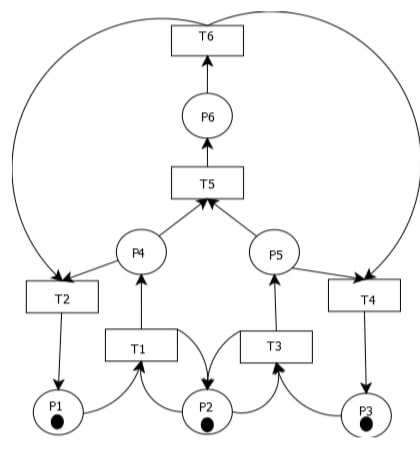
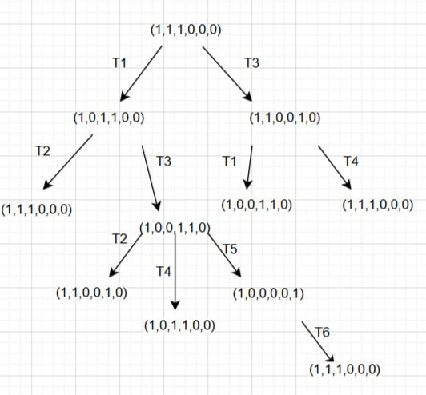
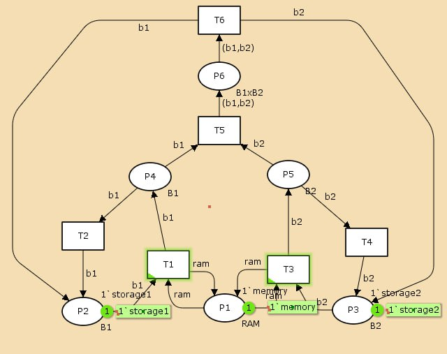
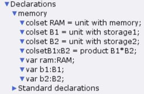
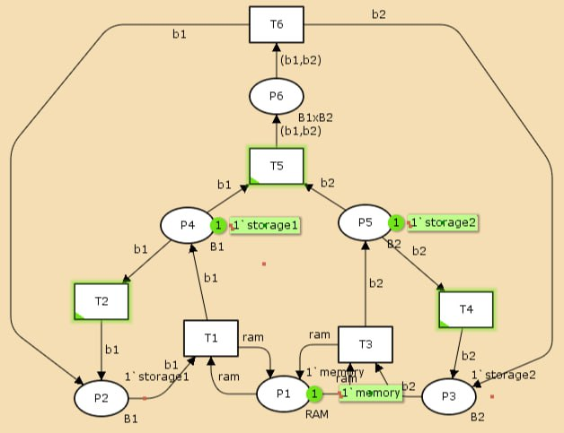
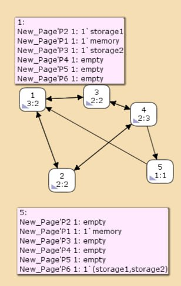

---
## Front matter
lang: ru-RU
title: Лабораторная работа 13
subtitle: Задание для самостоятельного выполнения
author:
  - Горяйнова А.А.
institute:
  - Российский университет дружбы народов, Москва, Россия

## i18n babel
babel-lang: russian
babel-otherlangs: english

## Formatting pdf
toc: false
toc-title: Содержание
slide_level: 2
aspectratio: 169
section-titles: true
theme: metropolis
header-includes:
 - \metroset{progressbar=frametitle,sectionpage=progressbar,numbering=fraction}
---

# Информация

## Докладчик

:::::::::::::: {.columns align=center}
::: {.column width="70%"}

  * Горяйнова Алёна Андреевна
  * студентка
  * Российский университет дружбы народов

:::
::: {.column width="30%"}


:::
::::::::::::::

## Постановка задачи

1. Используя теоретические методы анализа сетей Петри, проведите анализ сети,
изображённой на рис. 13.2 (с помощью построения дерева достижимости). Опре-
делите, является ли сеть безопасной, ограниченной, сохраняющей, имеются ли
тупики.
2. Промоделируйте сеть Петри (см. рис. 13.2) с помощью CPNTools.
3. Вычислите пространство состояний. Сформируйте отчёт о пространстве состоя-
ний и проанализируйте его. Постройте граф пространства состояний.

# Выполнение лабораторной работы

## Схема модели

Сеть Петри моделируемой системы 

{#fig:001 width=70%}

## Анализ сети Петри

Построим дерево достижимости.

{#fig:002 width=70%}

сеть:
- безопасна, поскольку в каждой
позиции количество фишек не превышает 1;
- ограничена, так как существует такое целое k, что число
фишек в каждой позиции не может превысить k (в данном случае k=1);
- сеть не имеет тупиков;
- сеть не является сохраняющей, так как при переходах t5 и t6 количество фишек меняется.

# Реализация модели в CPN Tools

## Реализуем описанную ранее модель в CPN Tools. 

{#fig:003 width=70%}

## Также зададим нужные декларации (рис. [-@fig:004]).

{#fig:004 width=70%}

## Запустив модель, можно посмотреть, как она работает 

{#fig:005 width=70%}

## Пространство состояний

Сформируем граф пространства состояний, их всего 5 

{#fig:006 width=70%}

## Сформируем отчёт о пространстве состояний и проанализируем его.  

```
Statistics
------------------------------------------------------------------------

  State Space
     Nodes:  5
     Arcs:   10
     Secs:   0
     Status: Full

  Scc Graph
     Nodes:  1
     Arcs:   0
     Secs:   0
```

## Выводы

В результате выполнения данной лабораторной работы я провела анализ сети Петри, построила сеть в CPN Tools, построила граф состояний и провела его анализ.

:::

