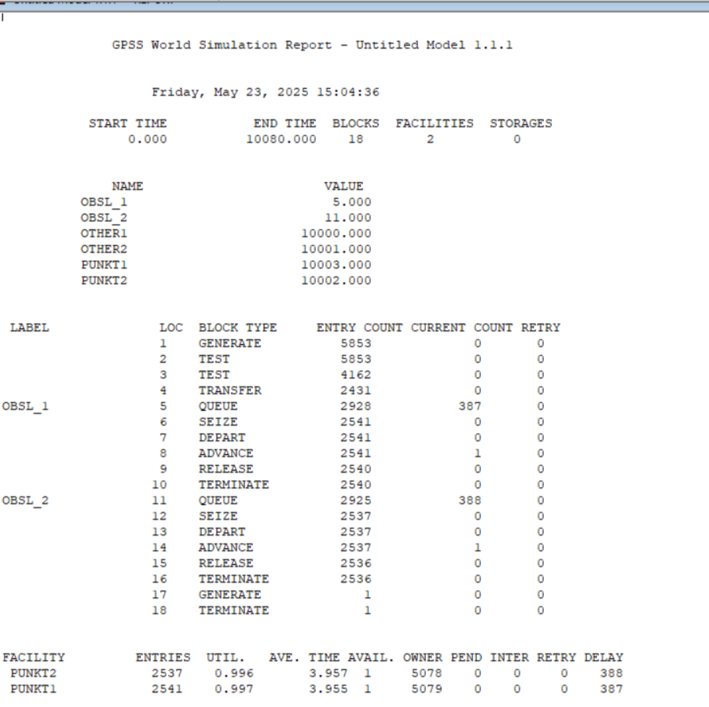
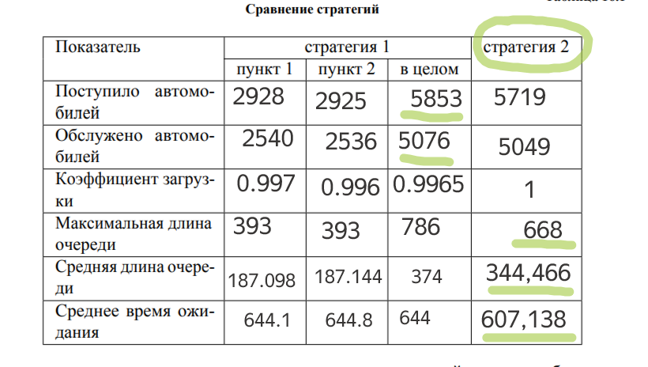
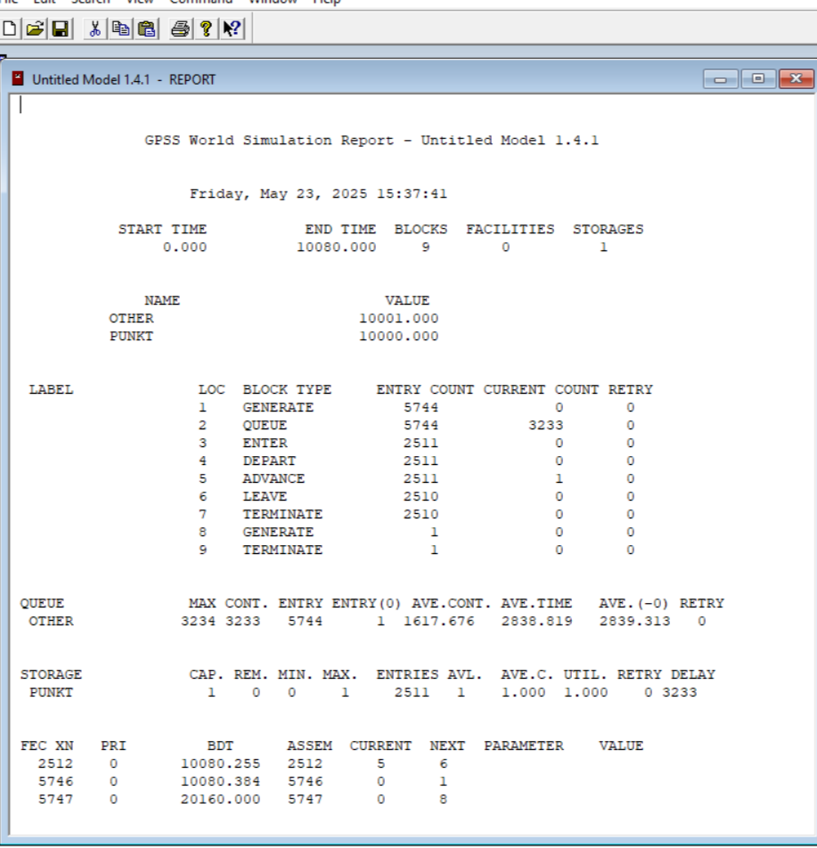
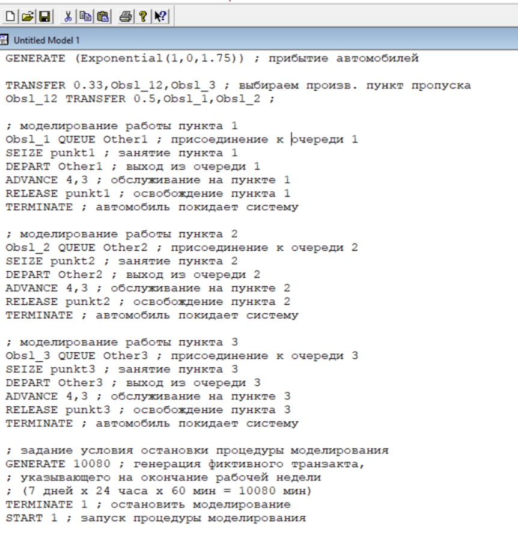
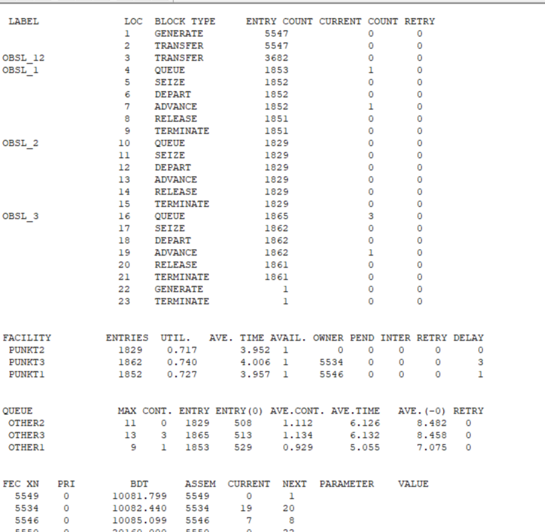
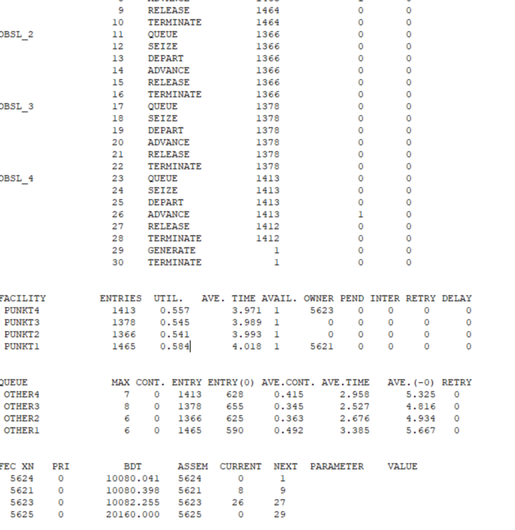

---
## Front matter
lang: ru-RU
title: Лабораторная работа 16
subtitle: Задачи оптимизации. Модель двух стратегий обслуживания
author:
  - Горяйнова А.А.
institute:
  - Российский университет дружбы народов, Москва, Россия

## i18n babel
babel-lang: russian
babel-otherlangs: english

## Formatting pdf
toc: false
toc-title: Содержание
slide_level: 2
aspectratio: 169
section-titles: true
theme: metropolis
header-includes:
 - \metroset{progressbar=frametitle,sectionpage=progressbar,numbering=fraction}
---

# Информация

## Докладчик

:::::::::::::: {.columns align=center}
::: {.column width="70%"}

  * Горяйнова Алёна Андреевна
  * студентка

  * Российский университет дружбы народов

:::
::: {.column width="30%"}

:::
::::::::::::::

# Цель работы

Реализовать с помощью GPSS модель двух стратегий обслуживания прибывающих автомобилей.

# Выполнение лабораторной работы

## Для первой стратегии обслуживания, когда прибывающие автомобили образуют две очереди и обслуживаются соответствующими пропускными пунктами, имеем следующую модель 

{#fig:001 width=70%}

## Для первой стратегии обслуживания, когда прибывающие автомобили образуют две очереди и обслуживаются соответствующими пропускными пунктами, имеем следующую модель 

{#fig:002 width=70%}

## Составим модель для второй стратегии обслуживания, когда прибывающие автомобили образуют одну очередь и обслуживаются освободившимся пропускным пунктом 

{#fig:003 width=70%}

## отчет по 2й стратегии

{#fig:004 width=70%}

## По получившимся отчетам, заполнили таблицу  

{#fig:005 width=70%}

## Изменим модели, чтобы определить оптимальное число пропускных пунктов (от 1 до 4). Будем подбирать под следующие критерии:

- коэффициент загрузки пропускных пунктов принадлежит интервалу [0, 5; 0, 95];
- среднее число автомобилей, одновременно находящихся на контрольно пропускном пункте, не должно превышать 3;
- среднее время ожидания обслуживания не должно превышать 4 мин.

## В случаее 2й стратегии с одним пунктом, значения превышают заданные в критериях 

{#fig:006 width=70%}

## Построим модель для второй стратегии с 3 пропускными пунктами 

{#fig:007 width=70%}

В этом случае все критерии выполняются, поэтому модель *оптимальна*.
## Построим модель для второй стратегии с 4 пропускными пунктами 

{#fig:008 width=70%}

## Построим модель для первой стратегии с 3 пропускными пунктами 

{#fig:009 width=70%}

## отчет по 1й стратегии с 3мя пунктами

{#fig:010 width=70%}

В этом случае среднее количество автомобилей в очереди меньше 3 и коэффициент загрузки в нужном диапазоне, но среднее время ожидания больше 4.

## Построим модель для второй стратегии с 4 пропускными пунктами и получим отчет

{#fig:011 width=70%}

## отчет по 1й стратегии с 4мя пунктами

{#fig:012 width=70%}

## Результат
В результате анализа наилучшим количеством пропускных пунктов будет *3 при втором типе обслуживания* и *4 при первом*.

## Выводы

В результате выполнения данной лабораторной работы я реализовала с помощью gpss:

- модель с двумя очередями;
- модель с одной очередью;
- изменить модели, чтобы определить оптимальное число пропускных пунктов.
