---
## Front matter
title: "Лабораторная работа 16"
subtitle: "Задачи оптимизации. Модель двух стратегий обслуживания"
author: "Горяйнова Алёна Андреевна"

## Generic otions
lang: ru-RU
toc-title: "Содержание"

## Bibliography
bibliography: bib/cite.bib
csl: pandoc/csl/gost-r-7-0-5-2008-numeric.csl

## Pdf output format
toc: true # Table of contents
toc-depth: 2
lof: true # List of figures
lot: true # List of tables
fontsize: 12pt
linestretch: 1.5
papersize: a4
documentclass: scrreprt
## I18n polyglossia
polyglossia-lang:
  name: russian
  options:
	- spelling=modern
	- babelshorthands=true
polyglossia-otherlangs:
  name: english
## I18n babel
babel-lang: russian
babel-otherlangs: english
## Fonts
mainfont: IBM Plex Serif
romanfont: IBM Plex Serif
sansfont: IBM Plex Sans
monofont: IBM Plex Mono
mathfont: STIX Two Math
mainfontoptions: Ligatures=Common,Ligatures=TeX,Scale=0.94
romanfontoptions: Ligatures=Common,Ligatures=TeX,Scale=0.94
sansfontoptions: Ligatures=Common,Ligatures=TeX,Scale=MatchLowercase,Scale=0.94
monofontoptions: Scale=MatchLowercase,Scale=0.94,FakeStretch=0.9
mathfontoptions:
## Biblatex
biblatex: true
biblio-style: "gost-numeric"
biblatexoptions:
  - parentracker=true
  - backend=biber
  - hyperref=auto
  - language=auto
  - autolang=other*
  - citestyle=gost-numeric
## Pandoc-crossref LaTeX customization
figureTitle: "Рис."
tableTitle: "Таблица"
listingTitle: "Листинг"
lofTitle: "Список иллюстраций"
lotTitle: "Список таблиц"
lolTitle: "Листинги"
## Misc options
indent: true
header-includes:
  - \usepackage{indentfirst}
  - \usepackage{float} # keep figures where there are in the text
  - \floatplacement{figure}{H} # keep figures where there are in the text
---

# Цель работы

Реализовать с помощью GPSS модель двух стратегий обслуживания прибывающих автомобилей.

# Задание

Реализовать с помощью GPSS:
- модель с двумя очередями
- модель с одной очередью
- свести полученные статистики моделирования в таблицу
- изменить модели, чтобы определить оптимальноее число пропускных пунктов для каждой стратегии

# Выполнение лабораторной работы
## Постановка задачи
На пограничном контрольно -пропускном пункте транспорта имеются 2 пункта
пропуска. Интервалы времени между поступлением автомобилей имеют экспоненци-
альное распределение со средним значением μ. Время прохождения автомобилями
пограничного контроля имеет равномерное распределение на интервале [a, b].
Предлагается две стратегии обслуживания прибывающих автомобилей:
1) автомобили образуют две очереди и обслуживаются соответствующими пунктами
пропуска;
2) автомобили образуют одну общую очередь и обслуживаются освободившимся
пунктом пропуска.
Исходные данные: μ = 1, 75 мин, a = 1 мин, b = 7 мин

## Построение модели

Целью моделирования является определение:

- характеристик качества обслуживания автомобилей, в частности, средних длин
очередей; среднего времени обслуживания автомобиля; среднего времени пребывания автомобиля на пункте пропуска;
- наилучшей стратегии обслуживания автомобилей на пункте пограничного контроля;
- оптимального количества пропускных пунктов.

В качестве критериев, используемых для сравнения стратегий обслуживания
автомобилей, выберем:

- коэффициенты загрузки системы;
- максимальные и средние длины очередей;
- средние значения времени ожидания обслуживания.

Для первой стратегии обслуживания, когда прибывающие автомобили образуют
две очереди и обслуживаются соответствующими пропускными пунктами, имеем
следующую модель (рис. [-@fig:001], [-@fig:001]).

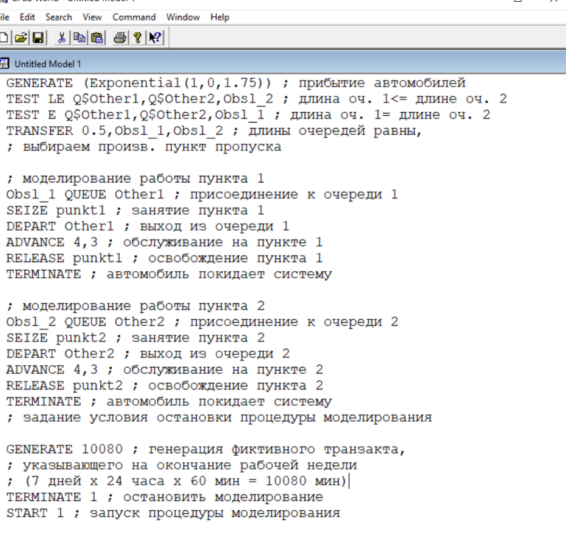{#fig:001 width=70%}

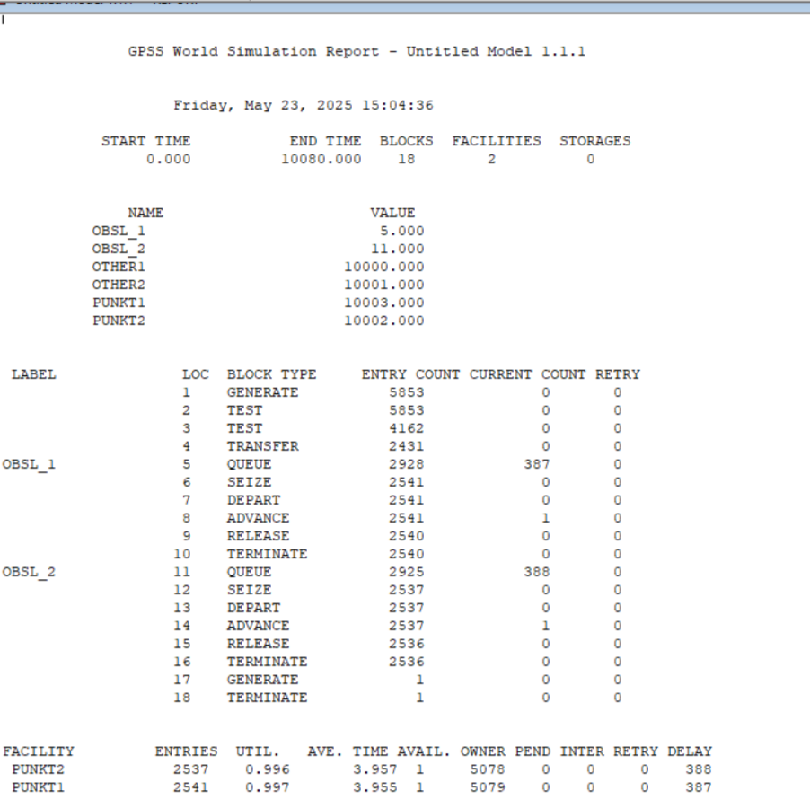{#fig:002 width=70%}

Составим модель для второй стратегии обслуживания, когда прибывающие автомобили образуют одну очередь и обслуживаются освободившимся пропускным пунктом (рис. [-@fig:003], [-@fig:004]).

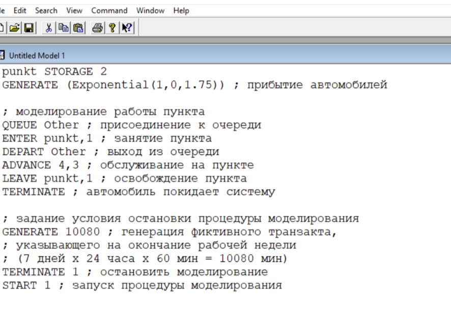{#fig:003 width=70%}

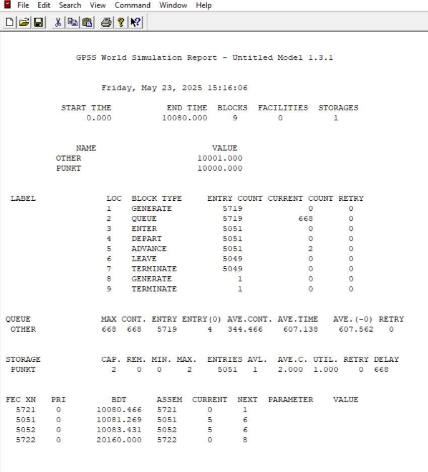{#fig:004 width=70%}

По получившимся отчетам, заполнили таблицу  (рис. [-@fig:005])

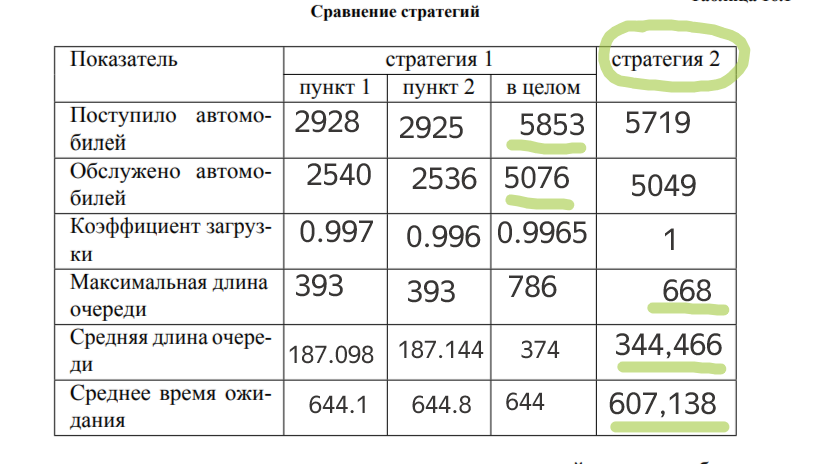{#fig:005 width=70%}

Изменим модели, чтобы определить оптимальное число пропускных пунктов (от 1 до 4). Будем подбирать под следующие критерии:

- коэффициент загрузки пропускных пунктов принадлежит интервалу [0, 5; 0, 95];
- среднее число автомобилей, одновременно находящихся на контрольно пропускном пункте, не должно превышать 3;
- среднее время ожидания обслуживания не должно превышать 4 мин.

В случаее 2й стратегии с одним пунктом, значения превышают заданные в критериях (рис. [-@fig:006])

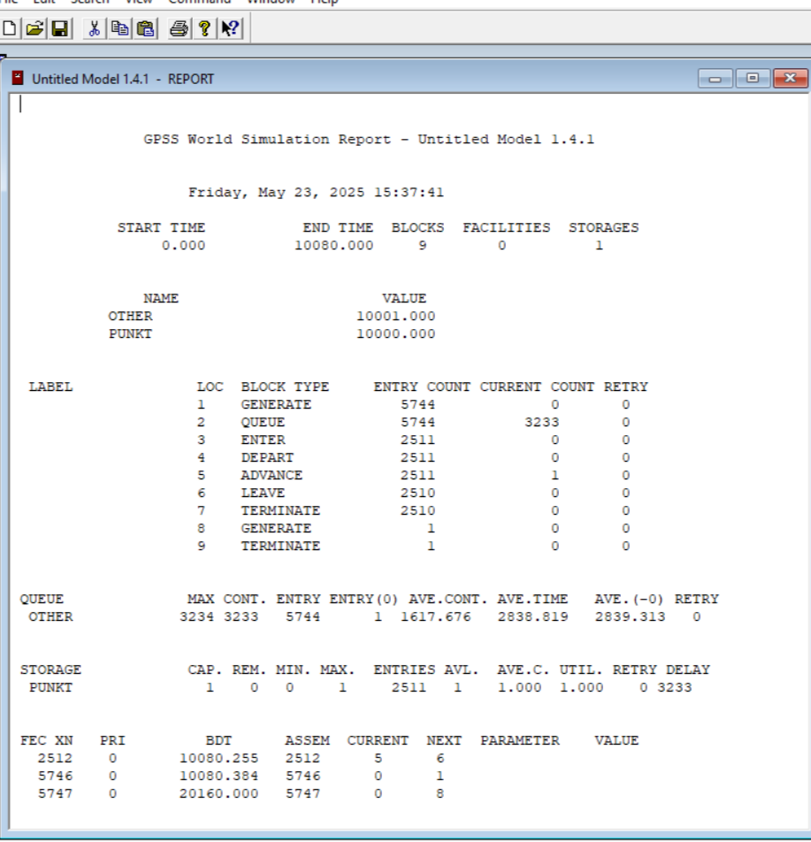{#fig:006 width=70%}

Построим модель для второй стратегии с 3 пропускными пунктами (рис. [-@fig:007])

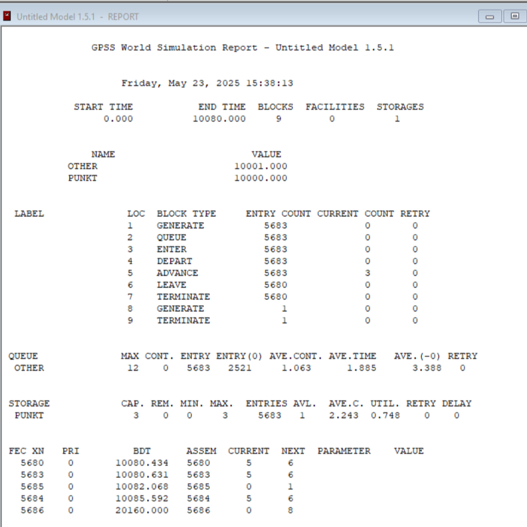{#fig:007 width=70%}

В этом случае все критерии выполняются, поэтому модель *оптимальна*.
Построим модель для второй стратегии с 4 пропускными пунктами (рис. [-@fig:008])

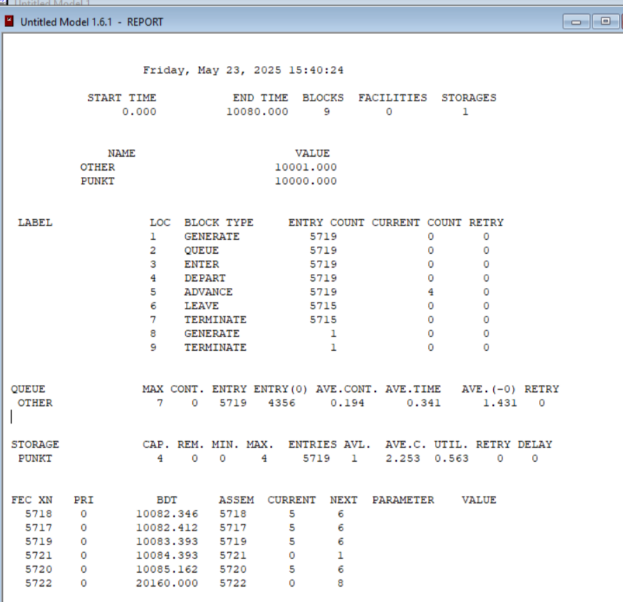{#fig:008 width=70%}

Построим модель для первой стратегии с 3 пропускными пунктами (рис. [-@fig:009])

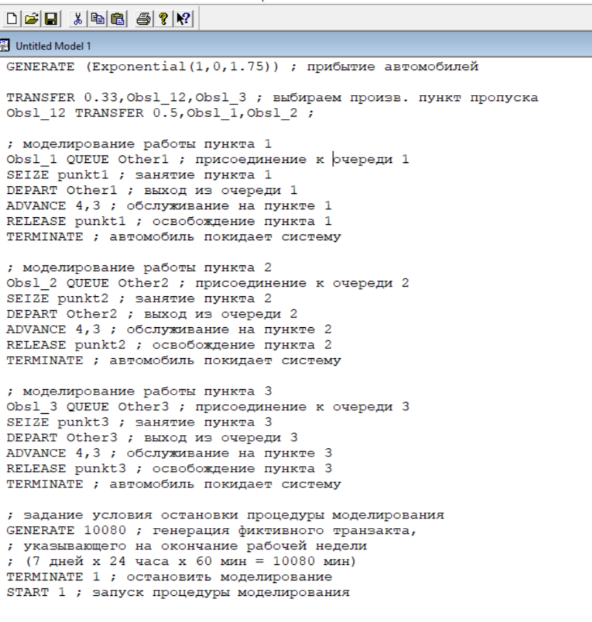{#fig:009 width=70%}

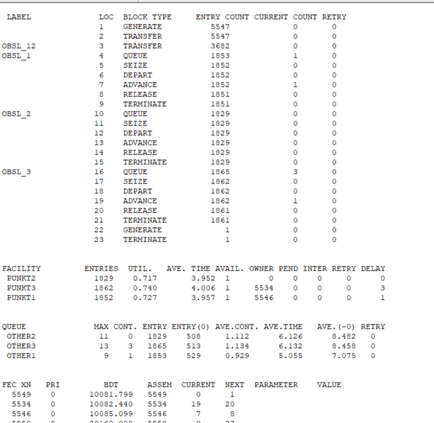{#fig:010 width=70%}

В этом случае среднее количество автомобилей в очереди меньше 3 и коэффициент загрузки в нужном диапазоне, но среднее время ожидания больше 4.

Построим модель для второй стратегии с 4 пропускными пунктами и получим отчет(рис. [-@fig:011], [-@fig:012]).

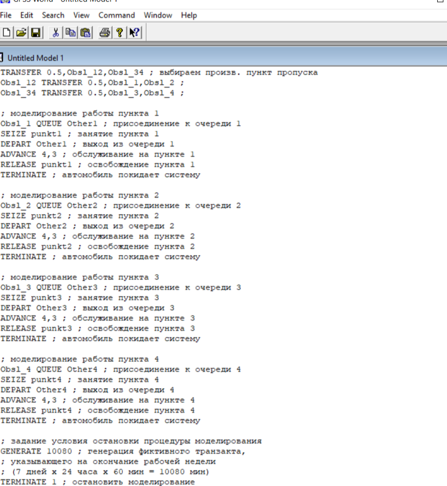{#fig:011 width=70%}

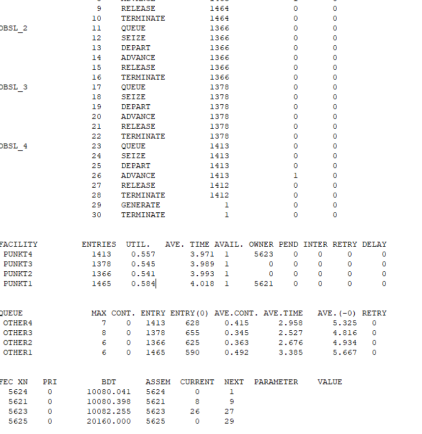{#fig:012 width=70%}

В результате анализа наилучшим количеством пропускных пунктов будет *3 при втором типе обслуживания* и *4 при первом*.

# Выводы

В результате выполнения данной лабораторной работы я реализовала с помощью gpss:

- модель с двумя очередями;
- модель с одной очередью;
- изменить модели, чтобы определить оптимальное число пропускных пунктов.

