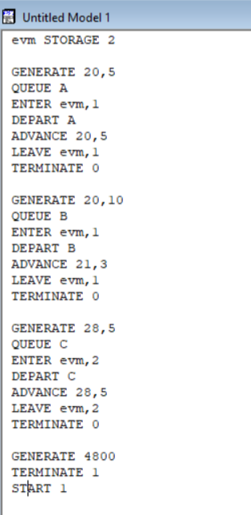
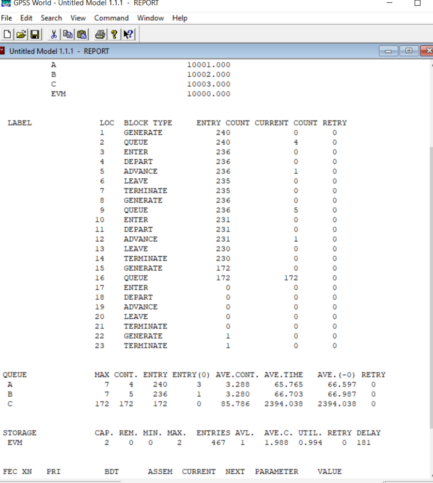
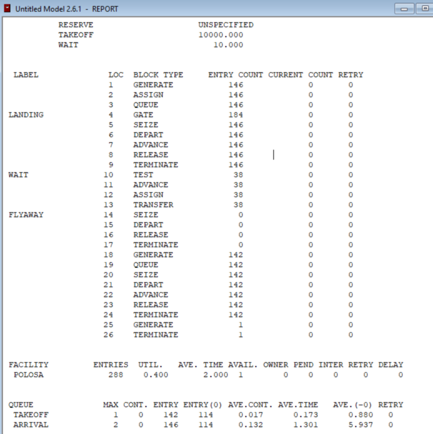
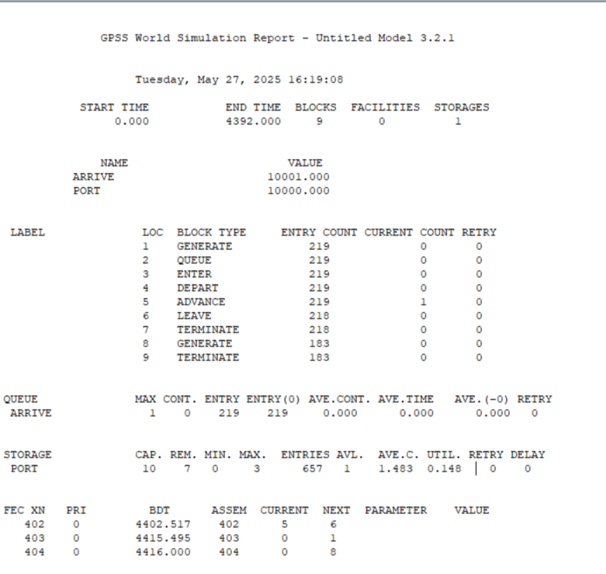
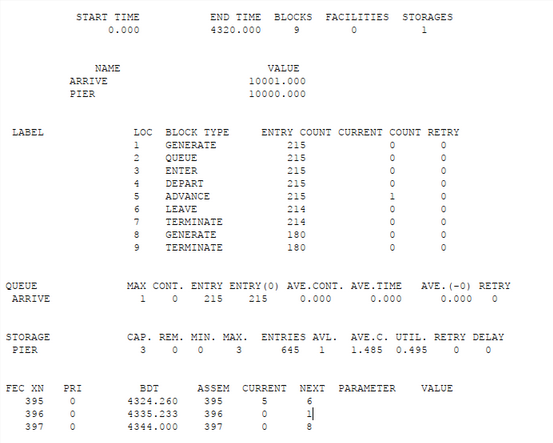
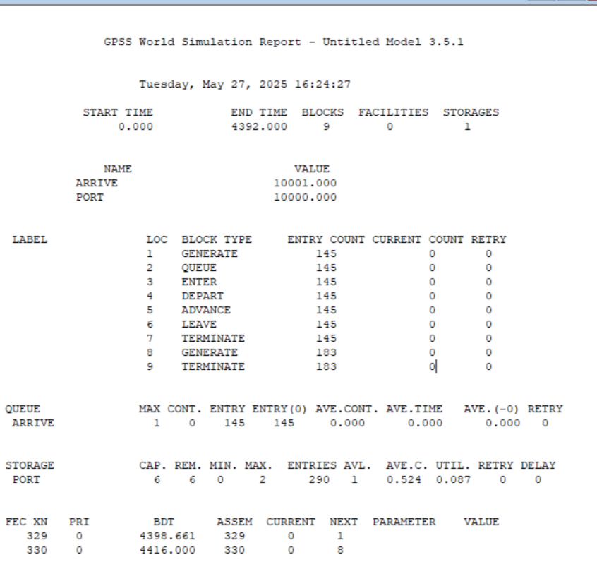

---
## Front matter
lang: ru-RU
title: Лабораторная работа 17
subtitle: Задания для самостоятельной работы
author:
  - Горяйнова А.А.
institute:
  - Российский университет дружбы народов, Москва, Россия

## i18n babel
babel-lang: russian
babel-otherlangs: english

## Formatting pdf
toc: false
toc-title: Содержание
slide_level: 2
aspectratio: 169
section-titles: true
theme: metropolis
header-includes:
 - \metroset{progressbar=frametitle,sectionpage=progressbar,numbering=fraction}
---

# Информация

## Докладчик

:::::::::::::: {.columns align=center}
::: {.column width="70%"}

  * Горяйнова Алёна Андреевна
  * студентка
  * Российский университет дружбы народов
:::
::: {.column width="30%"}

:::
::::::::::::::

## Цель работы

Реализовать с помощью gpss модели работы вычислительного центра, аэропорта и морского порта.

##  Задание

Реализовать с помощью gpss:

- модель работы вычислительного центра;
- модель работы аэропорта;
- модель работы морского порта.

# Выполнение лабораторной работы

## Моделирование работы вычислительного центра

{#fig:001 width=70%}

## Коэффициент загрузки составил 0, 994 (почти = 1), что означает, что ЭВМ работала беспрерывно

{#fig:002 width=70%}

## Модель работы аэропорта

{#fig:003 width=70%}

## Модель работы аэропорта
:::::::::::::: {.columns align=center}
::: {.column width="50%"}

Кол-во самолетов, которые:
- взлетели: 142
- сели: 146
- отправлены на запасной аэродром: 0
Коэффициент загрузки взлетно-посадочной полосы - 0,4. Большую часть времени полоса была свободна
:::
::: {.column width="50%"}

{#fig:004width=50%}

:::
::::::::::::::

## Моделирование работы морского порта 1

{#fig:005 width=70%}

## Порт был слишком свободным, поэтому оптимальным кол-вом причалов было число занимаемых судом причалов. 

:::::::::::::: {.columns align=center}
::: {.column width="50%"}

{#fig:006 width=90%}

:::
::: {.column width="50%"}

{#fig:007 width=90%}

:::
::::::::::::::

## Моделирование работы морского порта 2

{#fig:008 width=70%}

## Порт был слишком свободным, поэтому оптимальным кол-вом причалов было число занимаемых судом причалов. 

:::::::::::::: {.columns align=center}
::: {.column width="50%"}

{#fig:009 width=90%}

:::
::: {.column width="50%"}

{#fig:010 width=90%}

:::
::::::::::::::

## Выводы

В результате выполнения данной лабораторной работы я реализовала с помощью gpss:

- модель работы вычислительного центра;
- модель работы аэропорта;
- модель работы морского порта.

